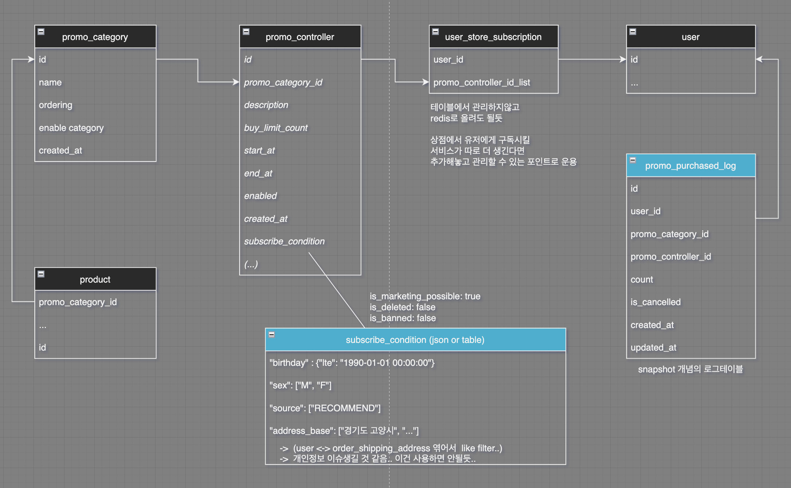

# Promo Tables

## Quick start

```bash
docker-compose up --build
```

## Usage

```bash
❯ make help
build                빌드 커맨드
clean                바이너리 및 기타 생성된 리소스 제거
flush                모든 진행상황 제거
help                 도움말
init                 테이블 초기화 커맨드
test                 CI 및 로컬 테스트용 커맨드
```

## Tables



| Name                    | Description                                                         | TODO                                             |
| ----------------------- | ------------------------------------------------------------------- | ------------------------------------------------ |
| product                 | Products for store service                                          |                                                  |
| promo_category          | All promotions created by operator, uses as additional category     |                                                  |
| promo_controller        | Promotion factory, creates one promotion in several forms           | Manage the 'subscribe condition' column in Redis |
| user_store_subscription | Records user-specific promotion controller subscription information |                                                  |
| user                    | all users                                                           |                                                  |
| promo_purchased_log     | Table created to record and search purchase history                 |                                                  |

[DrawIO File](./docs/promotion.drawio)
[Description](https://velog.io/@d3fau1t/프로모션-상품을-관리하기위한-테이블-설계)
